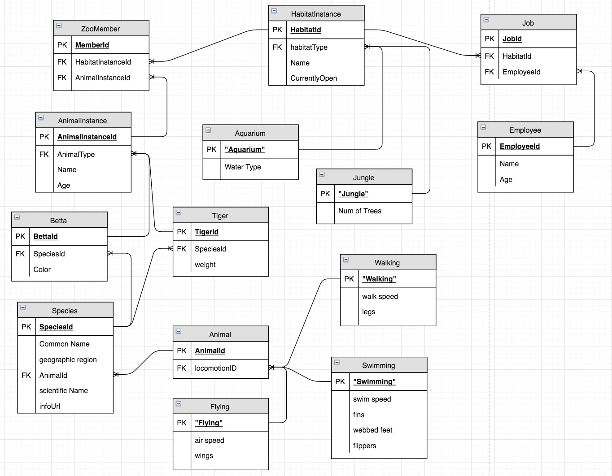

# Zoo ERD Exercise 

### Author: Megan Ford August 2016

Exercise completed as part of Nashville Software School's Back-end (Python) bootcamp, Milestone 3- Database Driven Applications. A demonstration of skills learned at time of creation. See below for instructions followed. 

# Exercise Instructions

[Original Readme](https://github.com/nashville-software-school/python-milestones/blob/master/03-database-driven-applications/exercises/DBS_ZOOLANDIA_ERD.md)

Use [draw.io](https://www.draw.io/) to make an ERD for the Zoolandia project. Make sure you define a primary key for each table, define which columns (if any) in each table that are a foreign key to another table, and include the appropriate 1-to-many relationship lines.

## Required tables/columns

### Animals

1. Name
2. Habitat
3. Age
4. Species

## Species

1. Name
2. Common name
3. Scientific name
4. Web URL for information

## Habitat Type

1. Name

## Habitats

1. Name
2. Type
3. Currently open

## Employees

1. Name
2. Age

## Employees/Habitats

Create a join table that allows you to assign an employees to *n* number of habitats for maintenance.

### License
[License](License.md)
